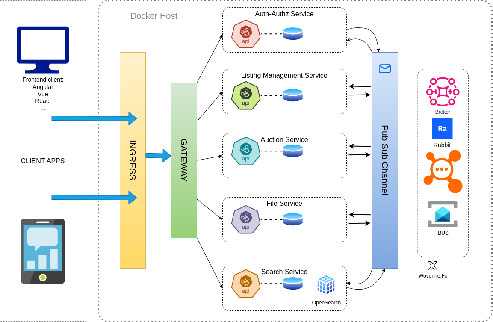

# The Marketplace - Microservices edition
## This repo presents a microservices architecture hosting The Marketplace API and implementing service based best practices.

### Architecture

## Architecture Overview

The diagram illustrates a modern, event-driven microservices architecture built on .NET with RabbitMQ and Wolverine.FX for messaging.

## Component Breakdown

### Client Applications Layer (Left Section)
The diagram shows two primary client types:
- **Frontend clients** - Web applications built with modern frameworks (Angular, Vue, React)
- **Mobile applications** - Represented by a smartphone icon with analytics interface

These client applications connect to the backend services through the ingress layer, matching the "Client Applications Layer" described in section 2.1 of the documentation.

### Ingress Layer (Yellow Vertical Bar)
Labeled "INGRESS" in the diagram, this component serves as the entry point for all external traffic, likely implemented using:
- Nginx, Traefik, or Envoy as specified in section 2.2
- Handles load balancing, TLS termination, and initial request routing

### API Gateway Layer (Green Vertical Bar)
Shown as "GATEWAY" in the diagram, this component:
- Routes client requests to appropriate microservices
- Implements the patterns described in section 2.3
- Likely built using YARP or Ocelot as specified in the documentation
- Serves as the unified entry point for client applications

### Docker Host Environment
The dotted-line container labeled "Docker Host" encompasses all backend services, reflecting the containerization approach outlined in section 5.1 of the documentation.

### Microservices Layer (Center Boxes)
The diagram shows five distinct microservices, each following the architecture described in section 2.5:
1. **Auth-Authz Service** - Handles authentication and authorisation, corresponding to the Identity Security Layer (section 2.4)
2. **Listing Management Service** - Manages product/service listings
3. **Auction Service** - Handles auction functionality
4. **File Service** - Manages file storage and retrieval
5. **Search Service** - Provides search capabilities with OpenSearch integration

Each service is depicted with:
- A hexagonal API component (color-coded)
- A database (blue cylinder)
- Clear boundaries between services, enforcing the domain separation described in the documentation

### Pub/Sub Channel (Blue Vertical Bar)
Labeled "Pub Sub Channel" in the diagram, this represents the asynchronous communication infrastructure described in section 4.2, allowing services to communicate without direct coupling.

### Message Broker Layer (Right Section)
The "Broker" section includes:
- **RabbitMQ** - The central message broker described in section 2.6
- **Wolverine.FX** - The messaging framework detailed in section 3, providing the handler infrastructure for processing messages

The circular network diagram (orange) represents the message routing topology of RabbitMQ exchanges and queues, facilitating the event-driven communication patterns.

## Data Flow Analysis

The arrows in the diagram illustrate both synchronous and asynchronous communication patterns described in section 4:

1. **Client-to-Gateway Flow**:
   - Blue arrows from client applications to the INGRESS layer
   - Representing synchronous HTTP requests as described in section 4.1

2. **Gateway-to-Service Flow**:
   - Diagonal arrows from GATEWAY to each microservice
   - Representing HTTP routing to the appropriate service endpoints

3. **Service-to-Message Bus Flow**:
   - Bidirectional arrows between services and the Pub Sub Channel
   - Reflecting the asynchronous event-based communication described in section 4.2
   - Enabling the publish/subscribe patterns central to the architecture

4. **Message Bus-to-Broker Flow**:
   - Connections between the Pub Sub Channel and the Broker infrastructure
   - Implementing the RabbitMQ integration detailed in section 3.1

## Technical Implementation Details

The diagram visually reinforces key technical decisions:

1. **Microservices Pattern**:
   - Each service has its own API and database, following the bounded context approach
   - Services are containerised within Docker as recommended in section 5.1

2. **Event-Driven Architecture**:
   - The prominent Pub Sub Channel and Broker components highlight the importance of asynchronous communication
   - Supports the message types (commands, events, queries) described in section 4.2

3. **API Gateway Pattern**:
   - The GATEWAY component centralises and abstracts the internal architecture from clients
   - Provides a unified entry point as detailed in section 2.3

4. **Security Implementation**:
   - The Auth-Authz Service handles the security concerns outlined in section 6
   - Gateway implements the authentication validation before forwarding requests

## Benefits Visualisation

The diagram effectively demonstrates the benefits described in section 8:

- **Scalability** - Services can be scaled independently
- **Resilience** - Failure isolation between services
- **Service Independence** - Clear boundaries and communication patterns
- **Flexibility** - Different database technologies per service as needed

The architecture diagram provides a visual representation of the detailed technical documentation, showing how the various components work together to create a modern, event-driven microservices platform. The implementation follows industry best practices for building distributed systems, with a focus on decoupling, scalability, and resilience through messaging patterns.

The combination of containerisation, API gateway routing, and the publisher/subscriber model with RabbitMQ and Wolverine.FX creates a robust foundation for developing and deploying independent microservices while maintaining reliable communication between them.
