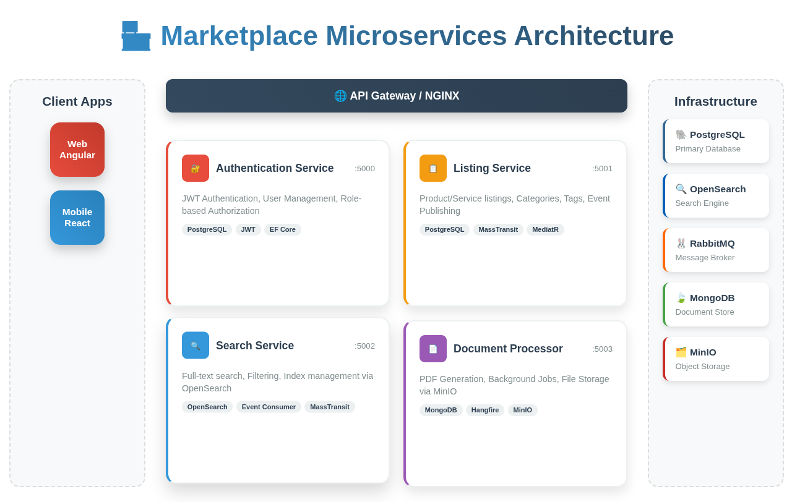
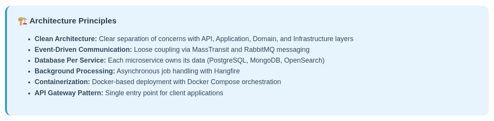

# The Marketplace - Microservices Architecture Overview

## This repository presents a microservices architecture hosting The Marketplace API and implementing service-based best practices with .NET 8, RabbitMQ, and MassTransit.

### Architecture Diagram


## Architecture Overview


The diagram illustrates a modern, event-driven microservices architecture built on .NET 8 with RabbitMQ and MassTransit for reliable messaging, implementing clean architecture principles throughout all services.

## Component Breakdown

### Client Applications Layer (Left Section)
The diagram shows two primary client types:
- **Web Applications** - Modern SPAs built with Angular, React, or Vue.js frameworks
- **Mobile Applications** - Native and cross-platform mobile apps for iOS and Android

These client applications connect to the backend services through the ingress and gateway layers, providing a unified interface while abstracting the internal microservices complexity.

### Ingress Layer (Entry Point)
The ingress layer serves as the primary entry point for all external traffic, implemented using:
- **NGINX** - High-performance reverse proxy and load balancer
- **SSL/TLS Termination** - Secure HTTPS handling and certificate management
- **Load Balancing** - Distribution of incoming requests across multiple gateway instances
- **Rate Limiting** - Protection against abuse and excessive requests

### API Gateway Layer (Unified Entry Point)
The gateway component provides:
- **Request Routing** - Intelligent routing to appropriate microservices based on URL patterns
- **Authentication Integration** - JWT token validation before forwarding requests to services
- **Request Aggregation** - Combining multiple service calls into unified client responses
- **Protocol Translation** - Converting between external and internal communication formats
- **Cross-Cutting Concerns** - Centralised logging, monitoring, and error handling

**Service Endpoints:**
- Authentication Gateway: http://localhost:5000/swagger
- Listing Management Gateway: http://localhost:5001/swagger
- Search Gateway: http://localhost:5002/swagger
- Document Processor Gateway: http://localhost:5003/swagger

### Docker Host Environment
The containerised environment encompasses all backend services, reflecting modern deployment practices:
- **Container Orchestration** - Docker Compose for local development, Kubernetes for production
- **Service Isolation** - Each service runs in its own container with defined resource limits
- **Health Monitoring** - Automated health checks and service recovery
- **Scalability** - Independent scaling of services based on demand

### Microservices Layer (Core Business Logic)

The architecture implements four distinct microservices following Clean Architecture principles:

#### 1. Authentication Service (Port 5000)
**Responsibilities:**
- User registration, login, and profile management
- JWT token issuance, validation, and refresh
- Role-based access control (Admin, Seller, Customer)
- Email confirmation workflows

**Technology Stack:**
- ASP.NET Core 8
- Entity Framework Core with PostgreSQL
- JWT Authentication
- FluentValidation for input validation

#### 2. Listing Management Service (Port 5001)
**Responsibilities:**
- Product and service listing management
- Hierarchical category organisation
- Tag-based classification system
- Event publishing for listing lifecycle changes

**Technology Stack:**
- ASP.NET Core 8
- Entity Framework Core with PostgreSQL
- MassTransit for event publishing
- MediatR for internal command/query handling

**Published Events:**
- `ListingCreated` - New listing added to marketplace
- `ListingUpdated` - Existing listing modifications
- `ListingPublished` - Listing becomes publicly available
- `ListingDeleted` - Listing removal from marketplace

#### 3. Search Service (Port 5002)
**Responsibilities:**
- Unified search across all marketplace entities
- Full-text search with relevancy scoring
- Advanced filtering and faceted search
- Real-time index updates via event consumption

**Technology Stack:**
- ASP.NET Core 8
- OpenSearch for search engine capabilities
- MassTransit for event consumption
- Custom indexing strategies

**Event Consumption:**
- Consumes listing events for real-time search index updates
- Maintains data consistency with source services
- Handles bulk re-indexing operations

#### 4. Document Processor Service (Port 5003)
**Responsibilities:**
- Background document processing
- PDF generation from templates
- File upload and storage management
- Asynchronous job processing

**Technology Stack:**
- ASP.NET Core 8
- Hangfire for background job processing
- MongoDB for document metadata
- MinIO for scalable object storage

Each service is depicted with:
- **Clean Architecture Layers** - API, Application, Domain, and Infrastructure
- **Independent Database** - Service-owned data storage following database-per-service pattern
- **Clear Service Boundaries** - Enforcing domain separation and loose coupling

### Event-Driven Communication (Message Bus)
The messaging infrastructure enables reliable asynchronous communication:

**RabbitMQ Message Broker:**
- **Exchanges** - Message routing based on patterns and content
- **Queues** - Durable message storage until processing
- **Dead Letter Queues** - Error handling for failed message processing
- **Publisher Confirms** - Ensuring reliable message delivery

**MassTransit Integration:**
- **Convention-Based Configuration** - Automatic exchange and queue setup
- **Message Serialisation** - JSON-based message formatting
- **Retry Policies** - Configurable retry strategies with exponential backoff
- **Circuit Breaker** - Protection against cascading failures

**Management Interface:** http://localhost:15672 (guest/guest)

### Supporting Infrastructure

**PostgreSQL Database:**
- Primary data store for Authentication and Listing services
- ACID transactions for data consistency
- Read replicas for scalability

**OpenSearch Engine:**
- Full-text search capabilities
- Analytics and aggregations
- Dashboard: http://localhost:5601

**MongoDB Document Store:**
- Document metadata storage
- Flexible schema for varied document types
- Optimised for document processing workflows

**MinIO Object Storage:**
- S3-compatible object storage
- Scalable file storage solution
- Management Console: http://localhost:9001 (minioadmin/minioadmin)

**Hangfire Job Processing:**
- Background job scheduling and execution
- Job retry and failure handling
- Dashboard: http://localhost:5003/hangfire

## Data Flow Analysis
The communication patterns demonstrate both synchronous and asynchronous interactions:

### 1. Client-to-Service Flow (Synchronous)
**Pattern:** HTTP/HTTPS requests through gateway
```
Client → Ingress → API Gateway → Microservice → Database
```
- **Authentication requests** to Authentication Service
- **CRUD operations** on listings through Listing Service
- **Search queries** to Search Service
- **File operations** through Document Processor

### 2. Service-to-Service Flow (Asynchronous)
**Pattern:** Event-driven messaging through RabbitMQ
```
Listing Service → RabbitMQ → Search Service
               → RabbitMQ → Document Processor
               → RabbitMQ → Notification Service (future)
```


**Event Flow Example:**
1. User creates a new listing via Listing Service
2. Listing Service publishes `ListingCreated` event to RabbitMQ
3. Search Service consumes event and updates search index
4. Document Processor generates listing PDF document
5. Email service (future) sends confirmation to user

### 3. Background Processing Flow
**Pattern:** Job queue processing
```
API Request → Background Job Queue → Hangfire → Processing → Storage
```
- PDF generation workflows
- Bulk data processing operations
- File format conversions

## Technical Implementation Highlights

### Clean Architecture Benefits
**Separation of Concerns:**
- **API Layer** - HTTP controllers and DTOs
- **Application Layer** - Business logic orchestration with MediatR
- **Domain Layer** - Business entities and rules
- **Infrastructure Layer** - Data access and external service integration

**Dependency Management:**
- Interface-based abstractions
- Dependency injection throughout all layers
- Testable architecture with mock-friendly interfaces

### Event-Driven Architecture Advantages
**Loose Coupling:**
- Services communicate through events, not direct calls
- Independent deployment and scaling capabilities
- Failure isolation between services

**Reliability:**
- Message persistence ensures no data loss
- Retry mechanisms handle transient failures
- Dead letter queues capture problematic messages

### Database Per Service Pattern
**Data Ownership:**
- Each service owns and manages its domain data
- Independent database technology choices per service
- Clear data boundaries and consistency models

**Scalability:**
- Independent database scaling based on service needs
- Optimised database configurations per service type
- Horisontal scaling without cross-service dependencies

## Development Workflow

### Local Development Setup
```bash
# Quick start - all services and infrastructure
./run-dev.sh all

# Alternative - Docker Compose
docker-compose up

# Development mode - infrastructure only
docker-compose up -d postgres opensearch opensearch-dashboards rabbitmq mongodb minio

# Run individual services
./run-dev.sh auth      # Authentication Service
./run-dev.sh listing   # Listing Service  
./run-dev.sh search    # Search Service
./run-dev.sh docs      # Document Processor
```

### Testing Strategy
```bash
# Unit tests
dotnet test

# Integration tests
dotnet test --filter Category=Integration

# End-to-end tests
dotnet test --filter Category=E2E
```

## Benefits Realisation

### Technical Benefits Demonstrated
- **Independent Scalability** - Services scale based on individual demand patterns
- **Technology Flexibility** - Different databases and technologies per service
- **Fault Isolation** - Service failures don't cascade to other components
- **Development Independence** - Teams can develop and deploy without coordination
- **Improved Maintainability** - Clear boundaries and responsibilities

### Business Benefits Achieved
- **Faster Feature Delivery** - Independent team velocity
- **Better Resource Utilisation** - Scale only what needs scaling  
- **Enhanced System Reliability** - Resilient to failures and load spikes
- **Cost Optimisation** - Resource allocation based on actual service needs
- **Market Responsiveness** - Rapid adaptation to changing business requirements

## Security Implementation

### Authentication & Authorisation
- **JWT Token Security** - Short-lived access tokens with refresh capability
- **Role-Based Access Control** - Admin, Seller, and Customer permissions
- **Service-to-Service Security** - Internal authentication between services

### Data Protection
- **Encryption at Rest** - Database and file storage encryption
- **Encryption in Transit** - TLS for all service communication
- **Input Validation** - Comprehensive validation using FluentValidation
- **Secret Management** - Secure configuration and credential handling

## Monitoring and Observability

### Logging Strategy
- **Structured Logging** - JSON-formatted logs with correlation IDs
- **Centralised Aggregation** - ELK Stack for log collection and analysis
- **Distributed Tracing** - Request tracking across service boundaries

### Performance Monitoring
- **Application Metrics** - Custom business and performance metrics
- **Infrastructure Monitoring** - Container, database, and message queue metrics
- **Health Checks** - Automated service health verification

## Future Roadmap

### Planned Enhancements
**Technical Evolution:**
- Event sourcing implementation for audit capabilities
- CQRS pattern for read/write optimisation
- GraphQL gateway for flexible client queries
- Machine learning integration for personalised recommendations

**Business Features:**
- Real-time notifications system
- Advanced recommendation engine
- Multi-vendor marketplace capabilities
- Mobile application development
- Third-party integration APIs

### Technology Considerations
- **Cloud Migration** - Kubernetes-based deployment strategies
- **Serverless Integration** - Function-based processing for specific workloads
- **Edge Computing** - Content delivery optimisation
- **AI/ML Services** - Intelligent search and recommendation capabilities

## Conclusion

This microservices architecture provides a robust, scalable foundation for The Marketplace platform. The combination of .NET 8, clean architecture principles, event-driven communication via RabbitMQ and MassTransit, and comprehensive DevOps practices creates a system optimised for:

- **Developer Productivity** - Clear patterns and well-defined boundaries
- **System Reliability** - Fault tolerance and graceful degradation
- **Business Agility** - Rapid feature development and deployment
- **Operational Excellence** - Comprehensive monitoring and automated operations

The architecture successfully demonstrates modern microservices best practices while providing a practical implementation that teams can understand, maintain, and evolve as business requirements change.

By implementing this design, The Marketplace platform is positioned to handle significant growth in users, transactions, and features while maintaining high performance, reliability, and developer satisfaction.
